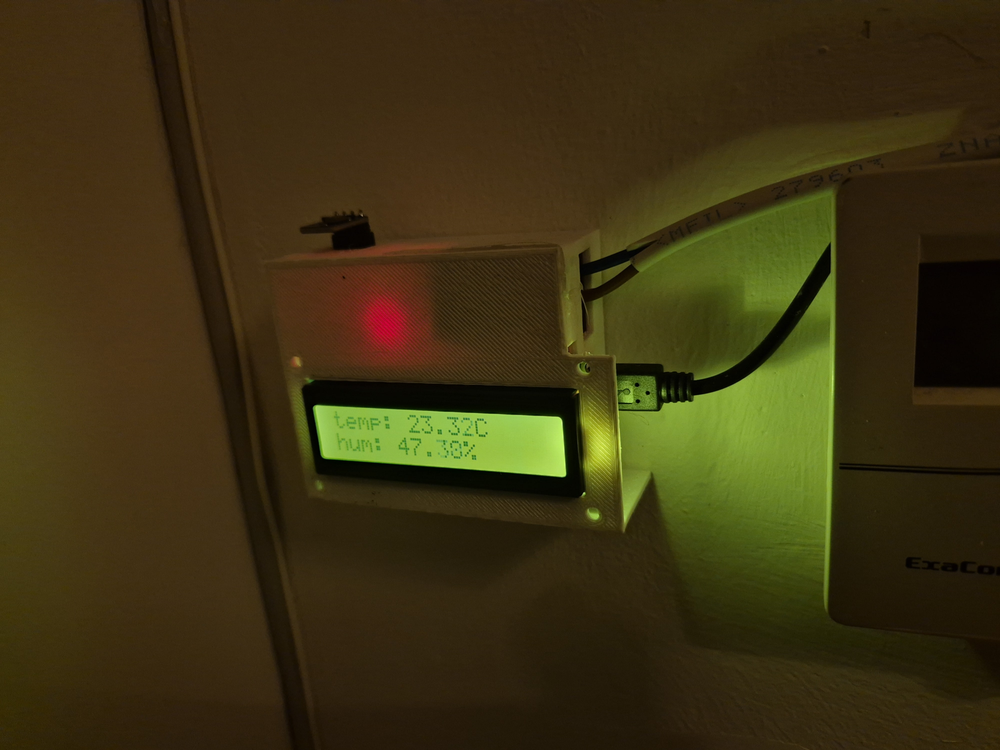

# Termostat DIY

Projekt powstał w ramach idei DIY i został zaprojektowany do regulacji temperatury w mieszkaniu. Został przetestowany we współpracy z piecem **Ariston HS PREMIUM 24 EU2**, jednak dzięki prostemu mechanizmowi działania, może być kompatybilny z wieloma innymi modelami pieców.

## Zasada działania

Większość pieców umożliwia zdalne uruchomienie grzania poprzez zwarcie odpowiednich styków. Termostat wykorzystuje tę możliwość: mikrokontroler steruje stanem przekaźnika (switcha), który łączy lub rozłącza obwód, wywołując działanie pieca.

Termostat zbiera dane z czujnika temperatury i wilgotności, a użytkownik może regulować temperaturę za pomocą enkodera cyfrowego. Wszystkie informacje (temperatura, wilgotność, temperatura zadana oraz histereza) wyświetlane są na ekranie TFT.

## Komponenty

- **Mikrokontroler:** Arduino Nano  
- **Wyświetlacz:** 1.8" TFT SPI 128x160 (wersja V1.1)  
- **Czujnik:** AHT10 (pomiar temperatury i wilgotności)  
- **Przekaźnik (switch):** JQC-3FF-S-Z  
- **Enkoder cyfrowy:** Cap EC11  

## Połączenia

### Przekaźnik (Switch) → Arduino

| Pin przekaźnika | Pin Arduino |
|-----------------|-------------|
| VCC             | 5V          |
| GND             | GND         |
| IN              | D7          |

### Czujnik AHT10 → Arduino

| Pin czujnika | Pin Arduino |
|--------------|-------------|
| VIN          | 5V          |
| GND          | GND         |
| SCL          | A5          |
| SDA          | A4          |

### Wyświetlacz TFT → Arduino

| Pin wyświetlacza | Pin Arduino |
|------------------|-------------|
| VCC              | 5V          |
| GND              | GND         |
| CS               | D10         |
| RESET            | D8          |
| A0               | D9          |
| SDA              | D11         |
| CSK              | D13         |
| LED              | 3V3         |

### Enkoder cyfrowy → Arduino

| Pin enkodera | Pin Arduino |
|--------------|-------------|
| GND          | GND         |
| S1           | D2          |
| S2           | D4          |
| KEY          | D3          |
| 5V           | 5V          |

## Używane biblioteki

Projekt wykorzystuje następujące biblioteki Arduino:

    Adafruit AHTX0

    Adafruit ST7735 and ST7789

Po zainstalowaniu tych bibliotek przez Menedżera Bibliotek Arduino IDE, wszystkie wymagane zależności (m.in. Adafruit GFX, SPI, Wire) zostaną pobrane automatycznie.

Instalacja:

    Otwórz Arduino IDE.

    Przejdź do: Szkic → Dołącz bibliotekę → Zarządzaj bibliotekami...

    Wyszukaj i zainstaluj:

        Adafruit AHTX0

        Adafruit ST7735 and ST7789

Nie trzeba instalować ręcznie bibliotek Adafruit GFX, SPI ani Wire – zostaną one dołączone automatycznie jako zależności.

## Pliki

- `Termostat_PCB.psb` – projekt płytki PCB w formacie kompatybilnym z [nazwa programu, np. Sprint Layout lub inny, jeśli dotyczy]

## Zdjęcia i schematy

Prototyp z prostszym wyświetlaczem i bez regulacji temperatury zadanej.

## Licencja

GPL