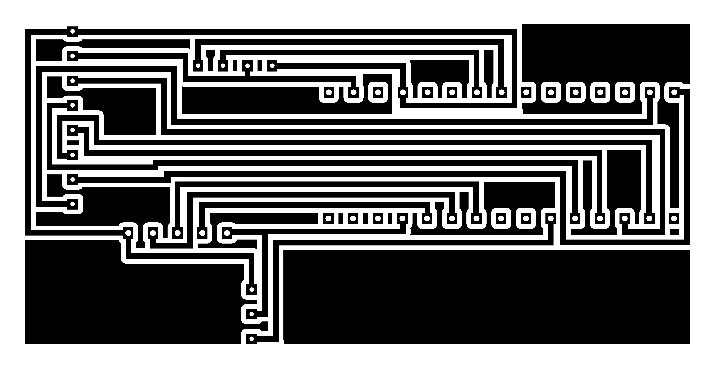

# DIY Thermostat

This project was created as part of the DIY concept and was designed for temperature regulation in an apartment. It was tested with the **Ariston HS PREMIUM 24 EU2** boiler, but due to its simple operation mechanism, it is compatible with many other boiler models.

## Operation Principle

Most boilers allow remote activation of heating by closing specific contacts. The thermostat takes advantage of this: the microcontroller controls the state of a relay (switch), which opens or closes the circuit, triggering the boiler to heat.

The thermostat collects data from the temperature and humidity sensor, and the user can adjust the temperature using a digital encoder. All the information (temperature, humidity, set temperature, and hysteresis) is displayed on the TFT screen.

## Components

- **Microcontroller:** Arduino Nano  
- **Display:** 1.8" TFT SPI 128x160 (V1.1 version)  
- **Sensor:** AHT10 (temperature and humidity sensor)  
- **Relay (switch):** JQC-3FF-S-Z  
- **Digital Encoder:** Cap EC11  

## Connections

### Relay (Switch) → Arduino

| Relay Pin  | Arduino Pin |
|------------|-------------|
| VCC        | 5V          |
| GND        | GND         |
| IN         | D7          |

### AHT10 Sensor → Arduino

| Sensor Pin | Arduino Pin |
|------------|-------------|
| VIN        | 5V          |
| GND        | GND         |
| SCL        | A5          |
| SDA        | A4          |

### TFT Display → Arduino

| Display Pin | Arduino Pin |
|-------------|-------------|
| VCC         | 5V          |
| GND         | GND         |
| CS          | D10         |
| RESET       | D8          |
| A0          | D9          |
| SDA         | D11         |
| SCK         | D13         |
| LED         | 3V3         |

### Digital Encoder → Arduino

| Encoder Pin | Arduino Pin |
|-------------|-------------|
| GND         | GND         |
| S1          | D2          |
| S2          | D4          |
| KEY         | D3          |
| 5V          | 5V          |

## PCB Board

## Libraries Used

This project uses the following Arduino libraries:

    Adafruit AHTX0

    Adafruit ST7735 and ST7789

Once these libraries are installed via the Arduino IDE Library Manager, all required dependencies (e.g., Adafruit GFX, SPI, Wire) will be automatically downloaded.

### Installation:

1. Open Arduino IDE.
2. Go to: Sketch → Include Library → Manage Libraries...
3. Search and install:
    - **Adafruit AHTX0**
    - **Adafruit ST7735 and ST7789**

You do not need to install the Adafruit GFX, SPI, or Wire libraries manually—they will be automatically included as dependencies.

## Files

- `Termostat_PCB.psb` – PCB design file in a format compatible with [program name, e.g., Sprint Layout or other, if applicable]

## Photos and Schematics

Prototype with a simpler display and without set temperature regulation.

## License

GPL